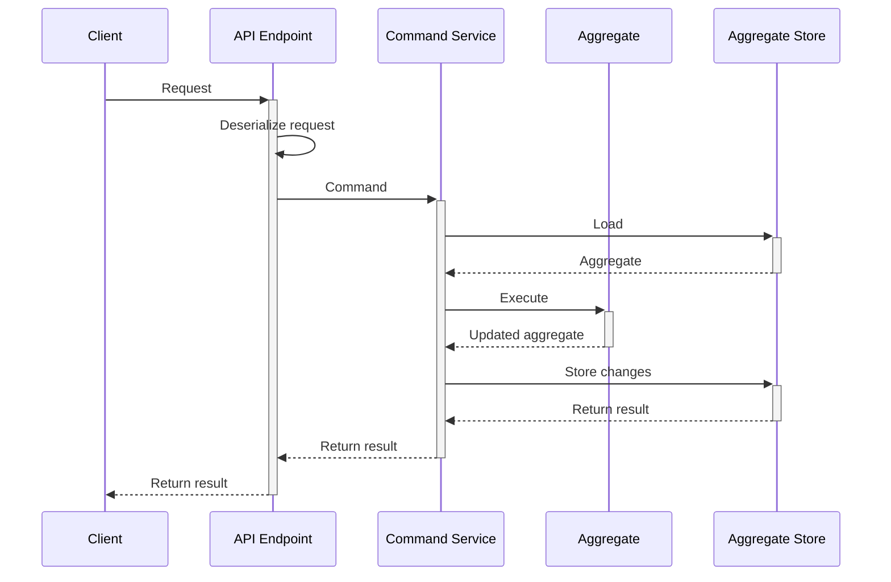

## Concept

The command service itself performs the following operations when handling one command:
1. Extract the aggregate id from the command, if necessary.
2. Instantiate all the necessary value objects. This could effectively reject the command if value objects cannot be constructed. The command service could also load some other aggregates, or any other information, which is needed to execute the command but won't change state.
3. If the command expects to operate on an existing aggregate instance, this instance gets loaded from the [Aggregate Store](../persistence/aggregate-store).
4. Execute an operation on the loaded (or new) aggregate, using values from the command, and the constructed value objects.
5. The aggregate either performs the operation and changes its state by producing new events, or rejects the operation.
6. If the operation was successful, the service persists new events to the store. Otherwise, it returns a failure to the edge.



:::caution Handling failures
The last point above translates to: the command service **does not throw exceptions**. It [returns](#result) an instance of `ErrorResult` instead. It is your responsibility to handle the error.
:::

## Implementation

Eventuous provides a base class for you to build command services. It is a generic abstract class, which is typed to the aggregate type. You should create your own implementation of a command service for each aggregate type. As command execution is transactional, it can only operate on a single aggregate instance, and, logically, only one aggregate type.

### Handling commands

The base class has one function that must be used in the service class constructor to define how the service will handle commands. The function is called `On<TCommand>` where `TCommand` is the command type. You can add as many command handlers as you need. The `On` function composes a command handler builder that allows to chain further details to describe how the command needs to be processed.

After calling `On`, add two more calls to the builder:
* `InState(ExpectedState)` to specify what is the expected aggregate state is. For example, if the `BookRoom` command expects that no booking exists with a given identity, you'd specify `InState(ExpectedState.New)`. There are three possible states: `New`, `Existing`, and `Any`.
* `GetId(Func<TCommand, TId>)` to explain the service how to use one or more properties of `TCommand` type to compose an identity object for loading and storing the aggregate state.

After that, use one of the `Act` functions to specify the business logic of the command handler. There are two available functions for it: `Act` and `ActAsync`.

Here is an example of a command service form our test project:

```csharp title="BookingService.cs"
public class BookingsCommandService 
    : CommandService<Booking, BookingState, BookingId> {
    public BookingsCommandService(
        IAggregateStore store, 
        Services.IsRoomAvailable isRoomAvailable
    ) : base(store) {
        On<BookRoom>()
            .InState(ExpectedState.New)
            .GetId(cmd => new BookingId(cmd.BookingId))
            .ActAsync(
                (booking, cmd, _) => {
                    var period = new StayPeriod(
                        LocalDate.FromDateTime(cmd.CheckInDate), 
                        LocalDate.FromDateTime(cmd.CheckOutDate)
                    ),
                    booking.BookRoom(
                        cmd.GuestId,
                        new RoomId(cmd.RoomId),
                        stayPeriod,
                        new Money(cmd.BookingPrice, cmd.Currency),
                        new Money(cmd.PrepaidAmount, cmd.Currency),
                        DateTimeOffset.Now,
                        isRoomAvailable
                    );
                }
            );

        On<RecordPayment>()
            .InState(ExpectedState.Existing)
            .GetId(cmd => new BookingId(cmd.BookingId))
            .Act((booking, cmd) => 
                booking.RecordPayment(
                    new Money(cmd.PaidAmount, cmd.Currency), 
                    cmd.PaymentId, 
                    cmd.PaidBy, 
                    DateTimeOffset.Now
                ));
    }
}
```

:::caution Stream name
Check the [stream name](../persistence/aggregate-stream#stream-name) documentation if you need to use custom stream names.
:::

### Result

The command service will return an instance of `Result<TState>`.

It could be an `OkResult<TState>`, which contains the new aggregate state and the list of new events. You use the data in the result to pass it over to the caller, if needed.

If the operation was not successful, the command service will return an instance of `ErrorResult` that contains the error message and the exception details.

### Bootstrap

If you registered the `EsdbEventStore` and the `AggregateStore` in your `Startup` as described on the [Aggregate store](../persistence/aggregate-store) page, you can also register the command service:

```csharp title="Program.cs"
builder.Services.AddCommandService<BookingCommandService, BookingState>();
```

The `AddCommandService` extension will register the `BookingService`, and also as `ICommandService<BookingState>`, as a singleton. Remember that all the DI extensions are part of the `Eventuous.Extensions.DependencyInjection` NuGet package.

When you also use `AddControllers`, you get the command service injected to your controllers.

You can simplify your application and avoid creating HTTP endpoints explicitly (as controllers or minimal API endpoints) if you use the [command API feature](command-api.md).

## Application HTTP API

The most common use case is to connect the command service to an HTTP API.

Read the [Command API](./command-api) feature documentation for more details.
