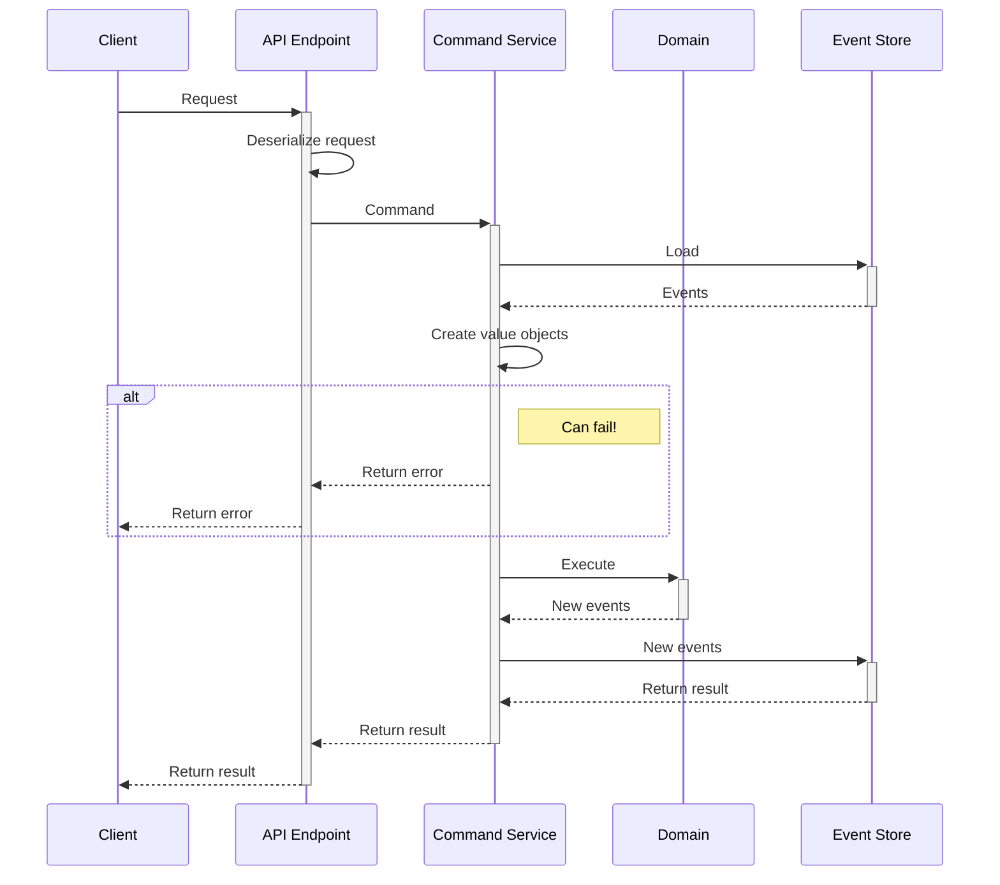
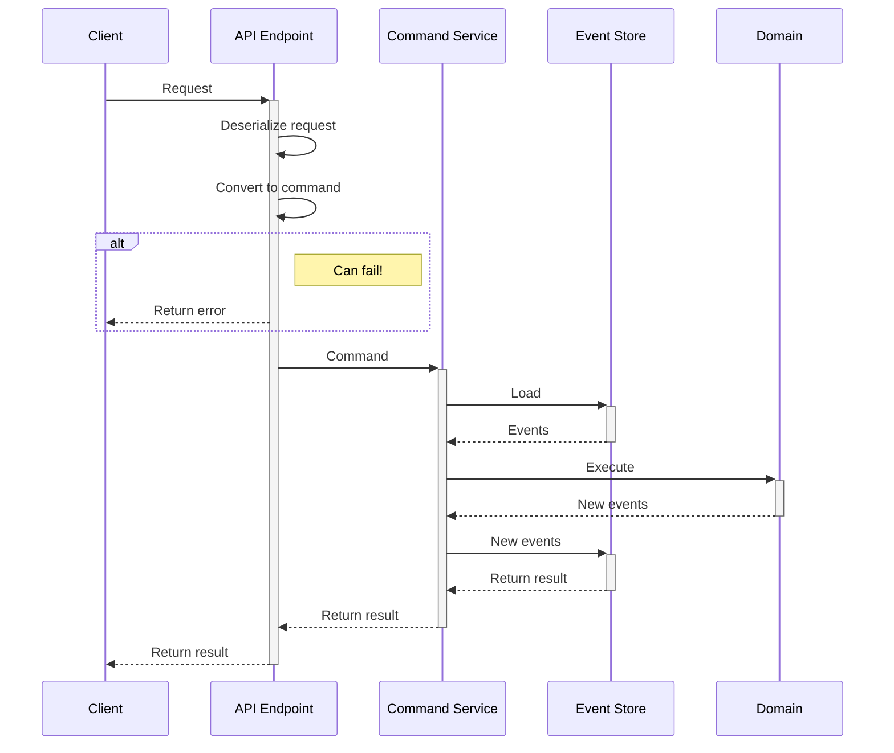

import Highlight from "@site/src/components/highlight";

## Motivation

In Eventuous samples you find commands that are defined using primitive value types like `string` or `int`. Such commands can be used as external contracts for application APIs. Sometimes, contract classes are referred to as DTOs (Data Transfer Objects). Probably the most important attribute of DTOs is that they are easily serializable and deserializable. Using DTOs enable interoperability between different applications and languages. You can, for example, call an API built with .NET from a frontend application written in JavaScript.

You might, however, wish to keep contract definitions on the edge, and make commands a part of your domain model. II can be useful when your domain model is being exposed to different edge interfaces, such as HTTP APIs, gRPC services, or message brokers. In such cases, you might want to use different contract classes for different interfaces. For example, you might want to use a different contract for a gRPC service than for a HTTP API, especially because gRPC contracts are generated from proto files.

Another reason to embed commands to the domain model is the ability to use value objects in commands, which is not recommended for external contracts. Value objects are a great way to model complex data structures, and they are a part of the domain model. However, value objects usually enforce instantiation rules that can break serialization.

Eventuous allows you to separate contract definitions from domain commands. You can define contracts as POCOs (Plain Old C# Objects) and map them to domain commands. This way you can use different contracts for different interfaces, and you can use value objects in commands. Apart from the benefit of conceptual separation, it also allows to fail invalid requests to the API early, before the command is passed to the command service.

### Using DTOs as commands

Here's how command handling usually works:

- API endpoint:
  - Receives a request
  - The request is deserialized to a command contract
  - The command is passed to the command service
- Command service 
  - Loads an aggregate or a stream <Highlight color="blue">**database call**</Highlight>
  - Creates the necessary value objects <Highlight color="red">**can fail**</Highlight>
  - Calls the domain model operation
  - Persists new events
  - Returns the result



As you can see, the command service would load events from event store before creating value objects. This is not a problem if the command is valid, but if the command is invalid, the value object creation will fail, and the request will be rejected. However, the command service will still load events from the event store, which is a waste of resources.

### Using mapped commands

When using mapped command, the flow changes:

- Command service
  - Maps the contract to a domain command <Highlight color="red">**can fail**</Highlight>
  - Loads an aggregate or a stream <Highlight color="blue">**database call**</Highlight>
  - Calls the domain model operation
  - Persists new events
  - Returns the result



As you can see, the value object creation is executed early, and when the command is invalid, the request is rejected before executing any database operation.

## Implementation

Depending on the API implementation pattern, you can use different ways to map contracts to domain commands.

Consider the following example:

```csharp title="Command contract"
public record RegisterPaymentHttp(
    string         BookingId,
    string         PaymentId,
    float          Amount,
    DateTimeOffset PaidAt
);
```

```csharp title="Domain command"
public record RecordPayment(
    BookingId BookingId,
    string PaymentId,
    Money Amount,
    DateTimeOffset PaidAt
);
```

There, you notice that the domain command uses value objects, and the contract only uses primitive types.

### Using controller base

When you implement your API using the `CommandHttpApiBase` or `CommandHttpApiBaseFunc` [base classes](./command-api.md#controller-base), you can provide the command mapper as a dependency. The mapper needs to be instantiated before the application starts, and injected to the controller.

Here is how the mapping is defined:

```csharp title="Program.cs"
var commandMap = new MessageMap()
    .Add<BookingApi.RegisterPaymentHttp, Commands.RecordPayment>(
        x => new Commands.RecordPayment(
            new BookingId(x.BookingId),
            x.PaymentId,
            new Money(x.Amount),
            x.PaidAt
        )
    );

builder.Services.AddSingleton(commandMap);
```

You can chain `Add` calls to map as many commands as you need.

Then, in the controller you need to use the `Handle<TContract, TCommand>` base class method, which will force the controller base to use the mapper to convert the contract to a domain command.

```csharp title="BookingController.cs"
public class BookingApi : CommandHttpApiBase<Booking> {
    public BookingApi(
        ICommandService<Booking> service,
        MessageMap? commandMap = null
    ) : base(service, commandMap) { }

    [HttpPost("v2/pay")]
    public Task<ActionResult<Result>> RegisterPayment(
        [FromBody] RegisterPaymentHttp cmd,
        CancellationToken cancellationToken
    )
        => Handle<RegisterPaymentHttp, Commands.RecordPayment>(cmd, cancellationToken);
}
```

### Using generated endpoints

When you use the [generated endpoints](./command-api.md#generated-command-api), you can use the `Map` method to map the contract to the domain command. You can also use data from the `HttpContext` to add additional information to the command, like the user identity. There's no need to add ignored properties to the contract in this case.

Consider the contract record being decorated by the `HttpCommand` attribute:

```csharp title="Command contract"
[HttpCommand(Route = "pay")]
public record RegisterPaymentHttp(
    string         BookingId,
    string         PaymentId,
    float          Amount,
    DateTimeOffset PaidAt
);
```

We can then define the domain command with an additional `PaidBy` property:

```csharp title="Domain command"
public record RecordPayment(
    BookingId      BookingId,
    string         PaymentId,
    Money          Amount,
    DateTimeOffset PaidAt,
    string         PaidBy // Additional information fro HttpContext
);
```

Here's how the mapping is defined:

```csharp title="Program.cs"
var app = builder.Build();

app
    .MapAggregateCommands<Booking>
    .MapCommand<ProcessPaymentHttp, Commands.ProcessPayment>(
        (cmd, ctx) => new Commands.ProcessPayment(
            new BookingId(cmd.BookingId), // Create value object from primitive
            cmd.PaymentId,                // Use primitive
            new Money(cmd.Amount),
            cmd.PaidAt,
            ctx.User.Identity.Name        // Use HttpContext to get user details
        )
    );
```

:::caution
Generated endpoints currently don't support [functional command services](./func-service). This functionality will be added in a future version.
:::