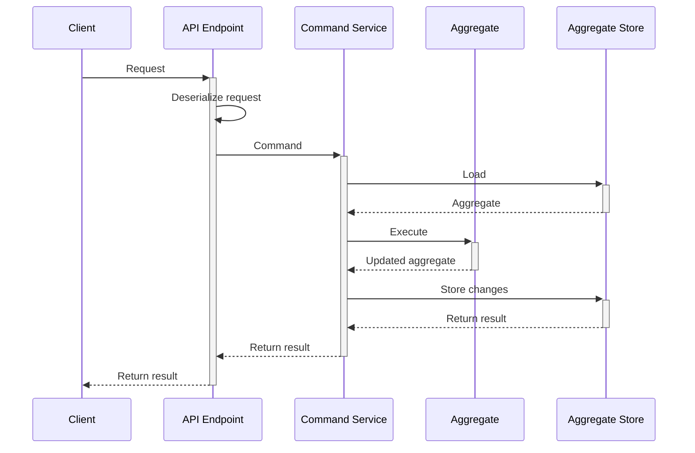

:::note
The Command Service base class is **optional**, it just makes your life a bit easier.
:::

## Concept

The command service itself performs the following operations when handling one command:
1. Extract the aggregate id from the command, if necessary.
2. Instantiate all the necessary value objects. This could effectively reject the command if value objects cannot be constructed. The command service could also load some other aggregates, or any other information, which is needed to execute the command but won't change state.
3. If the command expects to operate on an existing aggregate instance, this instance gets loaded from the [Aggregate Store](../persistence/aggregate-store).
4. Execute an operation on the loaded (or new) aggregate, using values from the command, and the constructed value objects.
5. The aggregate either performs the operation and changes its state by producing new events, or rejects the operation.
6. If the operation was successful, the service persists new events to the store. Otherwise, it returns a failure to the edge.



:::caution Handling failures
The last point above translates to: the command service **does not throw exceptions**. It [returns](#result) an instance of `ErrorResult` instead. It is your responsibility to handle the error.
:::

## Implementation

Eventuous provides a base class for you to build command services. It is a generic abstract class, which is typed to the aggregate type. You should create your own implementation of a command service for each aggregate type. As command execution is transactional, it can only operate on a single aggregate instance, and, logically, only one aggregate type.

### Handling commands

The base class has six methods, which you call in your class constructor to register the command handlers:

| Function          | What's it for                                                                                                                                                                                                                                                       |
|-------------------|---------------------------------------------------------------------------------------------------------------------------------------------------------------------------------------------------------------------------------------------------------------------|
| `OnNew`           | Registers the handler, which expects no instance aggregate to exist (create, register, initialise, etc). It will get a new aggregate instance. The operation will fail when it will try storing the aggregate state due to version mismatch.                        |
| `OnNewAsync`      | The same as `OnNew` but expect an asynchronous command handler.                                                                                                                                                                                                     |
| `OnExisting`      | Registers the handler, which expect an aggregate instance to exist. You need to provide a function to extract the aggregate id from the command. The handler will get the aggregate instance loaded from the store, and will throw if there's no aggregate to load. |
| `OnExistingAsync` | The same as `OnExisting` but expect an asynchronous command handler.                                                                                                                                                                                                |
| `OnAny`           | Used for handlers, which can operate both on new and existing aggregate instances. The command service will _try_ to load the aggregate, but won't throw if the load fails, and will pass a new instance instead.                                                   |
| `OnAnyAsync`      | The same as `OnAny` but expect an asynchronous command handler.                                                                                                                                                                                                     |

Here is an example of a command service form our test project:

```csharp title="BookingService.cs"
public class BookingService
  : CommandService<Booking, BookingState, BookingId> {
    public BookingService(IAggregateStore store) : base(store) {
        OnNew<Commands.BookRoom>(
            cmd => new BookingId(cmd.BookingId),
            (booking, cmd)
                => booking.BookRoom(
                    cmd.RoomId,
                    new StayPeriod(cmd.CheckIn, cmd.CheckOut),
                    cmd.Price,
                    cmd.BookedBy,
                    cmd.BookedAt
                )
        );

        OnAny<Commands.ImportBooking>(
            cmd => new BookingId(cmd.BookingId),
            (booking, cmd)
                => booking.Import(
                    cmd.RoomId,
                    new StayPeriod(cmd.CheckIn, cmd.CheckOut)
                )
        );
    }
}
```

You pass the command handler as a function to one of those methods. The function can be inline, like in the example, or it could be a method in the command service class.

In addition, you need to specify a function, which extracts the aggregate id from the command, as both of those methods will try loading the aggregate instance from the store.

:::caution Stream name
Check the [stream name](../persistence/aggregate-stream#stream-name) documentation if you need to use custom stream names.
:::

#### Async command handlers

If you need to get outside your process boundary when handling a command, you most probably would need to execute an asynchronous call to something like an external HTTP API or a database. For those cases you need to use async overloads:

- `OnNewAsync`
- `OnExistingAsync`
- `OnAnyAsync`

These overloads are identical to sync functions, but the command handler function needs to return `Task`, so it can be awaited.

### Result

The command service will return an instance of `Result`.

It could be an `OkResult`, which contains the new aggregate state and the list of new events. You use the data in the result to pass it over to the caller, if needed.

If the operation was not successful, the command service will return an instance of `ErrorResult` that contains the error message and the exception details.

### Bootstrap

If you registered the `EsdbEventStore` and the `AggregateStore` in your `Startup` as described on the [Aggregate store](../persistence/aggregate-store) page, you can also register the command service:

```csharp title="Program.cs"
builder.Services.AddCommandService<BookingCommandService, Booking>();
```

The `AddCommandService` extension will register the `BookingService`, and also as `ICommandService<Booking>`, as a singleton. Remember that all the DI extensions are part of the `Eventuous.AspNetCore` NuGet package.

When you also use `AddControllers`, you get the command service injected to your controllers.

You can simplify your application and avoid creating HTTP endpoints explicitly (as controllers or minimal API endpoints) if you use the [command API feature](command-api.md).

## Application HTTP API

The most common use case is to connect the command service to an HTTP API.

Read the [Command API](./command-api) feature documentation for more details.
