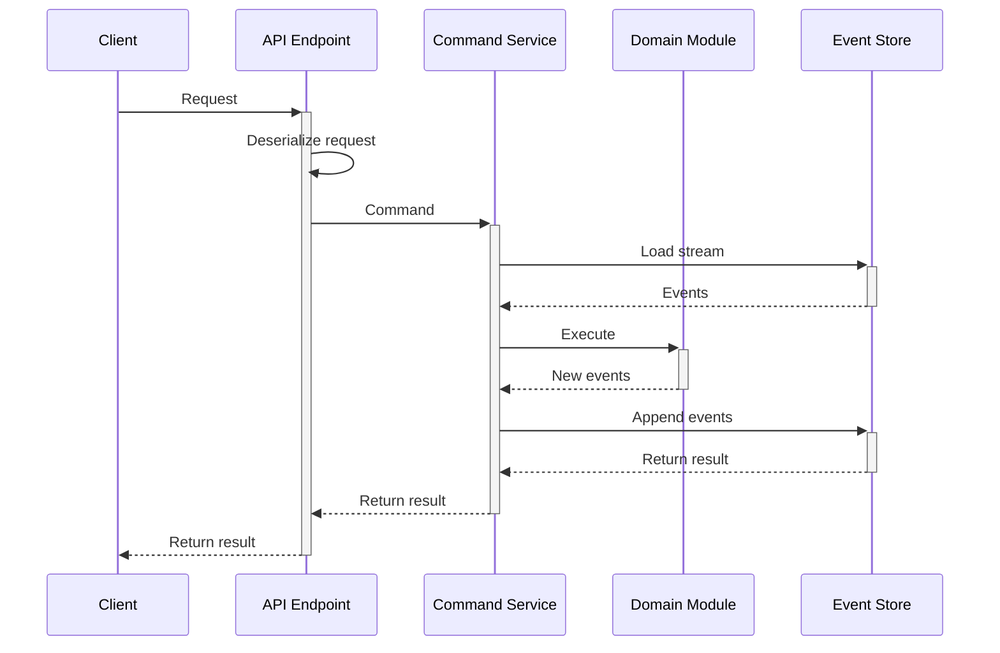

## Concept

The functional command service is an alternative way to handle commands. There, you don't use aggregates for the domain model. Instead, you define a set of stateless functions that receive the restored state instance and the collection of previously stored events, and produces new events. The service performs the following operations when handling one command:
1. Extract the stream name from the command, if necessary.
2. Instantiate all the necessary value objects. This could effectively reject the command if value objects cannot be constructed. The command service could also load some other streams, or any other information, which is needed to execute the command but won't change state.
3. If the command expects to operate on an existing stream, the stream events get loaded from the [Event Store](../persistence/event-store).
4. Restore state from the loaded events.
5. Execute an operation on the loaded (or new) state and events, using values from the command, and the constructed value objects.
6. The function either performs the operation and produces new events, or rejects the operation. It can also do nothing.
7. If the operation was successful, the service persists new events to the store. Otherwise, it returns a failure to the edge.



:::caution Handling failures
The last point above translates to: the command service **does not throw exceptions**. It [returns](./app-service.md#result) an instance of `ErrorResult` instead. It is your responsibility to handle the error.
:::

## Implementation

Eventuous provides a base class for you to build functional command services. It is a generic abstract class, which is typed to the state type. You should create your own implementation of a service for each state type. As command execution is transactional, it can only operate on a single stream, and, logically, only one state type. However, there is no strong link between the state type and the stream name. You can use the same state type for multiple streams, or use different state types for the same stream.

### Handling commands

The base class has three methods, which you call in your class constructor to register the command handlers:

| Function     | What's it for                                                                                                                                                                                                                                                          |
|--------------|------------------------------------------------------------------------------------------------------------------------------------------------------------------------------------------------------------------------------------------------------------------------|
| `OnNew`      | Registers the handler, which expects that the stream doesn't exist. It will get a new state object instance. The operation will fail when it will try storing events due to version mismatch.                                                                          |
| `OnExisting` | Registers the handler, which expect an existing stream where it will load events from. You need to provide a function to extract the stream name from the command. The handler will get the events loaded from the store, and will throw if there's no stream to load. |
| `OnAny`      | Used for handlers, which can operate both on new and existing streams. The command service will _try_ to load events from the given stream, but won't throw if the load fails, and will pass a new state instance instead.                                             |

Here is an example of a functional command service form our test project:

```csharp title="BookingFuncService.cs"
public class BookingFuncService : FunctionalCommandService<BookingState> {
    public BookingFuncService(IEventStore store, TypeMapper? typeMap = null) : base(store, typeMap) {
        // Register command handlers
        OnNew<BookRoom>(cmd => GetStream(cmd.BookingId), BookRoom);
        OnExisting<RecordPayment>(cmd => GetStream(cmd.BookingId), RecordPayment);

        // Helper function to get the stream name from the command
        static StreamName GetStream(string id) => new StreamName($"Booking-{id}");

        // When there's no stream to load, the function only receives the command
        static IEnumerable<object> BookRoom(BookRoom cmd) {
            yield return new RoomBooked(cmd.RoomId, cmd.CheckIn, cmd.CheckOut, cmd.Price);
        }

        // For an existing stream, the function receives the state and the events
        static IEnumerable<object> RecordPayment(
            BookingState state, 
            object[] originalEvents, 
            RecordPayment cmd
        ) {
            if (state.HasPayment(cmd.PaymentId)) yield break;

            var registered = new BookingPaymentRegistered(cmd.PaymentId, cmd.Amount.Amount);

            yield return registered;

            // Apply the payment to the state
            var newState = state.When(registered);
            if (newState.IsFullyPaid()) 
                yield return new BookingFullyPaid(cmd.PaidAt);
            if (newState.IsOverpaid()) 
                yield return new BookingOverpaid((state.AmountPaid - state.Price).Amount);
        }
    }
}
```

The service uses the same `BookingState` record as described on the [State](../domain/state) page.

### Usage

Because the functional service base class implements the same `ICommandService` interface, it can be used the same way as any other command service, by calling the `Handle<TCommand>` method from the API controller. You can, therefore, use it in API controllers similar to the command service:

```csharp title="Api/Bookings.cs"
[Route("/booking")]
public class CommandApi : ControllerBase {
    IFuncCommandService<Booking> _service;

    public CommandApi(IFuncCommandService<Booking> service) 
        => _service = service;

    [HttpPost]
    [Route("book")]
    public async Task<ActionResult<Result>> BookRoom(
        [FromBody] BookRoom cmd, 
        CancellationToken cancellationToken
    ) {
        var result = await _service.Handle(cmd, cancellationToken);
        result Ok(result);
    }
}
```

:::caution
Mapping commands to HTTP endpoints won't work with functional services. These features are coming in upcoming releases.
:::

You can also use the `CommandHttpApiBaseFunc` base class as described on the [command API](./command-api.md) page.

### Registration

You can add a functional service to the DI container using the `AddFunctionalService` extensions methods:

```csharp title="Program.cs"
// Any dependency will be injected
builder.Services.AddFunctionalService<BookingFuncService, BookingState>();

// Specify dependencies explicitly
builder.Services.AddFunctionalService(sp => 
    new AnotherFuncService(sp.GetRequiredService<IEventStore>(), customTypeMap)
);
```