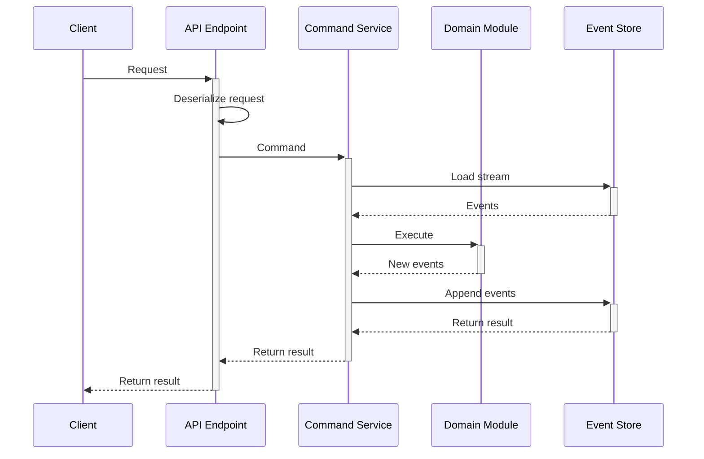

import NoThrowWarning from './_service_no_throw.mdx';
import Result from './_result.mdx';
import Bootstrap from "./_service_registration.mdx";
import HttpApi from "./_service_http.mdx";

## Concept

The functional command service is an alternative way to handle commands. There, you don't use aggregates for the domain model. Instead, you define a set of stateless functions that receive the restored state instance and the collection of previously stored events, and produces new events. The service performs the following operations when handling one command:
1. Extract the stream name from the command, if necessary.
2. Instantiate all the necessary value objects. This could effectively reject the command if value objects cannot be constructed. The command service could also load some other streams, or any other information, which is needed to execute the command but won't change state.
3. If the command expects to operate on an existing stream, the stream events get loaded from the [Event Store](../persistence/event-store).
4. Restore state from the loaded events.
5. Execute an operation on the loaded (or new) state and events, using values from the command, and the constructed value objects.
6. The function either performs the operation and produces new events, or rejects the operation. It can also do nothing.
7. If the operation was successful, the service persists new events to the store. Otherwise, it returns a failure to the edge.



<NoThrowWarning/>

## Implementation

Eventuous provides a base class for you to build functional command services. It is a generic abstract class, which is typed to the state type. You should create your own implementation of a service for each state type. As command execution is transactional, it can only operate on a single stream, and, logically, only one state type. However, there is no strong link between the state type and the stream name. You can use the same state type for multiple streams, or use different state types for the same stream.

:::note
Add `Eventuous.Application` NuGet package to your project.
:::

### Handling commands

The base class has one function that must be used in the service class constructor to define how the service will handle commands. The function is called `On<TCommand>` where `TCommand` is the command type. You can add as many command handlers as you need. The `On` function composes a command handler builder that allows to chain further details to describe how the command needs to be processed.

After calling `On`, add three more calls to the builder:
* Define expected stream state using `InState(ExpectedState)`. For example, if the `BookRoom` command expects that no booking exists with a given identity, you'd specify `InState(ExpectedState.New)`. There are three possible states: `New`, `Existing`, and `Any`.
* Resolve stream name from command using `GetStream(Func<TCommand, StreamName>)`.
* Use one of the `Act` functions to specify the business logic of the command handler. There are two available functions for it: `Act` and `ActAsync`.

Here is an example of a functional command service form our test project:

```csharp title="BookingFuncService.cs"
public class BookingFuncService : CommandService<BookingState> {
    public BookingFuncService(IEventStore store) : base(store) {
        On<BookRoom>()
            .InState(ExpectedState.New)
            .GetStream(cmd => GetStream(cmd.BookingId))
            .Act(BookRoom);

        On<RecordPayment>()
            .InState(ExpectedState.Existing)
            .GetStream(cmd => GetStream(cmd.BookingId))
            .Act(RecordPayment);

        On<ImportBooking>()
            .InState(ExpectedState.Any)
            .GetStream(cmd => GetStream(cmd.BookingId))
            .Act(ImportBooking);

        return;

        static IEnumerable<object> BookRoom(BookRoom cmd)
            => [new RoomBooked(cmd.RoomId, cmd.CheckIn, cmd.CheckOut, cmd.Price)];

        static IEnumerable<object> ImportBooking(
            BookingState state,
            object[] events,
            ImportBooking cmd
        ) => [new BookingImported(cmd.RoomId, cmd.Price, cmd.CheckIn, cmd.CheckOut)];

        static IEnumerable<object> RecordPayment(
            BookingState state,
            object[] originalEvents,
            RecordPayment cmd
        ) {
            if (state.HasPayment(cmd.PaymentId)) yield break;

            var registered = new BookingPaymentRegistered(cmd.PaymentId, cmd.Amount.Amount);

            yield return registered;

            var newState = state.When(registered);

            if (newState.IsFullyPaid())
                yield return new BookingFullyPaid(cmd.PaidAt);

            if (newState.IsOverpaid())
                yield return new BookingOverpaid((state.AmountPaid - state.Price).Amount);
        }
    }
}
```

The service uses the same `BookingState` record as described on the [State](../domain/state) page.

<Result/>

<Bootstrap/>

<HttpApi/>