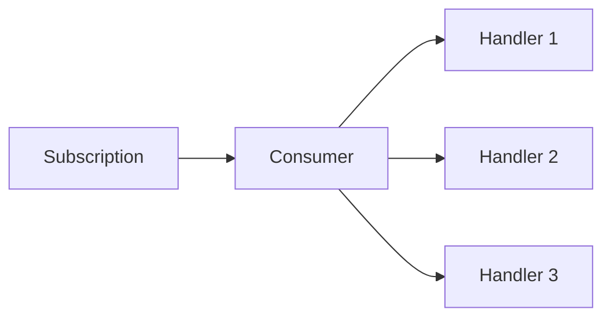
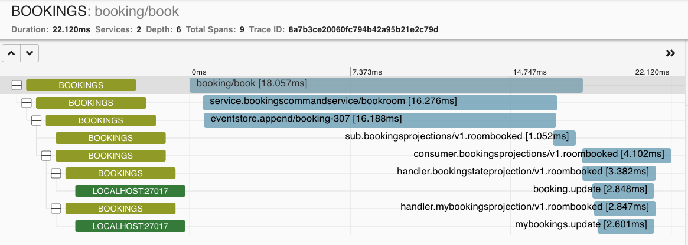

Out of the box, Eventuous provides metrics and traces for monitoring your subscriptions.

Also, study the [Diagnostics](../../diagnostics) section for more information.

## Mind the gap

When using subscriptions for read model projections, you enter to the world of [CQRS](https://zimarev.com/blog/event-sourcing/cqrs/) and asynchronous messaging. After completing a transaction in the domain model, one or more events are added to the event store. Then, a subscription picks it up and calls a projection. Although in most cases you'll see only a few milliseconds delay between these operations, if your projection becomes slow (for example, it uses a slow database), the processing time will increase.

The easiest way to detect such situations is to observe the gap between the last event in the stream, which the subscription listens to, and the event, which is currently being processed. We call it the **subscription gap**.

:::caution Alerting for the gap
If the gap increases continuously, your subscription is not catching up with all the events it receives. You need to set up a proper metric for the gap, and trigger an alert if the gap exceeds the value you can tolerate.
:::

The gap is measured by subscriptions that implement the `IMeasuredSubscription` interface:

```csharp
public interface IMeasuredSubscription {
    GetSubscriptionGap GetMeasure();
}
```

Subscription gaps are collected as metrics. Read more about Eventuous subscription metrics below.

## Subscription metrics

Eventuous collects two types of metrics for subscriptions:
- Subscription gap in time and count
- Subscription performance

For the subscription gap, Eventuous collects the time and count of the gap between the last event in the stream, which the subscription listens to, and the event, which is currently being processed.

Keep in mind that due to the limitation of EventStoreDB, the gap event count is not accurate when subscribing to `$all` stream. It's because the `$all` stream position is the commit position of the event in the global log, not the position of the event in the stream. Unfortunately, as per today, it is impossible to translate the commit position gap to the number of events.

Here is an example of the subscription gap metric exported to Prometheus:

```prometheus
# HELP eventuous_subscription_gap_count_events Gap between the last processed event and the stream tail
# TYPE eventuous_subscription_gap_count_events gauge
eventuous_subscription_gap_count_events{subscription_id="BookingsProjections"} 1098 1649081749067
eventuous_subscription_gap_count_events{subscription_id="PaymentIntegration"} 0 1649081749067
```

In addition to the subscription gap metric, Eventuous also collects metrics for the subscription performance as a histogram. The metric name is `eventuous_subscription_duration`. It measures the duration of handling a single event. As handling different event types might trigger different kinds of processing, the histogram is tagged with the message type (`message_type` tag).

All the subscription metrics are tagged by the subscription id (`subscription_id` tag). It allows you to plot a graph of the subscription metrics for different subscriptions.

Here is an example of the subscription duration metrics exported as a Prometheus [metric](https://prometheus.io/docs/practices/naming/) for the subscription with id `BookingsProjections`:

```prometheus
# HELP eventuous_subscription_duration_ms Processing duration, milliseconds
# TYPE eventuous_subscription_duration_ms histogram
eventuous_subscription_duration_ms_bucket{message_type="V1.RoomBooked",partition="0",subscription_id="BookingsProjections",le="0"} 0 1649081749067
eventuous_subscription_duration_ms_bucket{message_type="V1.RoomBooked",partition="0",subscription_id="BookingsProjections",le="5"} 0 1649081749067
eventuous_subscription_duration_ms_bucket{message_type="V1.RoomBooked",partition="0",subscription_id="BookingsProjections",le="10"} 0 1649081749067
eventuous_subscription_duration_ms_bucket{message_type="V1.RoomBooked",partition="0",subscription_id="BookingsProjections",le="25"} 0 1649081749067
eventuous_subscription_duration_ms_bucket{message_type="V1.RoomBooked",partition="0",subscription_id="BookingsProjections",le="50"} 0 1649081749067
eventuous_subscription_duration_ms_bucket{message_type="V1.RoomBooked",partition="0",subscription_id="BookingsProjections",le="75"} 1 1649081749067
eventuous_subscription_duration_ms_bucket{message_type="V1.RoomBooked",partition="0",subscription_id="BookingsProjections",le="100"} 1 1649081749067
eventuous_subscription_duration_ms_bucket{message_type="V1.RoomBooked",partition="0",subscription_id="BookingsProjections",le="250"} 1 1649081749067
eventuous_subscription_duration_ms_bucket{message_type="V1.RoomBooked",partition="0",subscription_id="BookingsProjections",le="500"} 1 1649081749067
eventuous_subscription_duration_ms_bucket{message_type="V1.RoomBooked",partition="0",subscription_id="BookingsProjections",le="1000"} 1 1649081749067
eventuous_subscription_duration_ms_bucket{message_type="V1.RoomBooked",partition="0",subscription_id="BookingsProjections",le="+Inf"} 1 1649081749067
eventuous_subscription_duration_ms_sum{message_type="V1.RoomBooked",partition="0",subscription_id="BookingsProjections"} 50.429 1649081749067
eventuous_subscription_duration_ms_count{message_type="V1.RoomBooked",partition="0",subscription_id="BookingsProjections"} 1 1649081749067
```

## Subscription tracing

Each part of the subscription event processing [pipeline](../pipes) is traced. Each event is wrapped into a consume context by the subscription, then passed to the consumer. The consumer then calls all the event handlers.



As all Eventuous producers and event store(s) are instrumented, they propagate the trace context to the subscription. The subscription then propagates the trace context to the consumer, and the consumer then propagates the trace context to the event handlers, so all these operations are traced.

Here's an example of the trace context propagated to the subscription visualized by Zipkin:



As you can see, event handlers for the `BookingProjection` subscription are projections, and trigger updates in MongoDB, which are also traced because the sample application is instrumented by MongoDB tracing library.

As mentioned before, Eventuous ensures that the tracing context is propagated also remotely, so you get the full trace even if the subscription is running in a different process.

## Health checks

The subscription service class also implements the `IHealthCheck` interface. Therefore, it can be used for [ASP.NET Core health monitoring](https://docs.microsoft.com/en-us/aspnet/core/host-and-deploy/health-checks?view=aspnetcore-5.0).

When using Eventuous dependency injection extensions, each registered subscription will also register its health checks.

However, you need to register the global Eventuous subscriptions health check by adding one line to the ASP.NET Core health checks registration:

```csharp title="Program.cs"
builder.Services
    .AddHealthChecks()
    .AddSubscriptionsHealthCheck("subscriptions", HealthStatus.Unhealthy, new []{"tag"});
```

