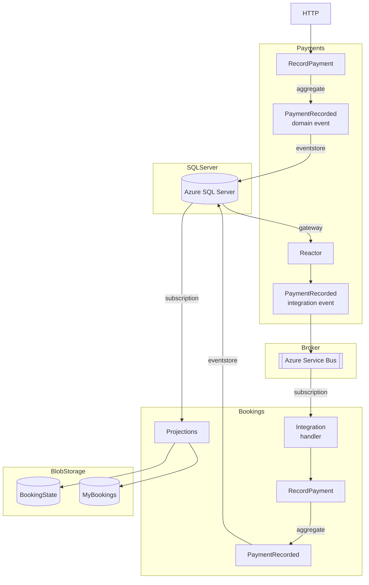

# Bookings sample application - Azure

This project demonstrates how to use Eventuous in an Azure environment, showcasing:
 * Event-sourced domain model using `Aggregate` and `AggregateState`
 * Aggregate persistence using Azure SQL Server
 * Read models stored in Azure Blob Storage
 * Integration between services using Azure Service Bus messaging
 * Orchestration and local development using .NET Aspire

## .NET Aspire

[.NET Aspire](https://learn.microsoft.com/en-us/dotnet/aspire/) is a cloud-ready stack for building observable, production-ready distributed applications. It provides:

 * **Service discovery and orchestration** - Manages dependencies between services and infrastructure
 * **Unified configuration** - Centralized configuration for all services and resources
 * **Dashboard** - A visual representation of the application's architecture and health
 * **Local development** - Run dependencies like Azure SQL Server and Azure Service Bus emulators as containers

To use .NET Aspire, follow the instruction [here](https://aspire.dev/get-started/install-cli/) or install the workload using the .NET CLI:

```bash
dotnet workload install aspire
```

For a better development experience, install the official extensions:
 * [Visual Studio: .NET Aspire tools](https://marketplace.visualstudio.com/items?itemName=ms-dotnettools.dotnet-aspire)
 * [Visual Studio Code: .NET Aspire](https://marketplace.visualstudio.com/items?itemName=ms-dotnettools.vscode-dotnet-aspire)

This sample uses Aspire to orchestrate the Bookings and Bookings.Payments services along with their Azure dependencies (SQL Server, Service Bus, and Blob Storage).

## Usage

Start the application using Aspire from the `Bookings.AppHost` directory:

```bash
cd samples/azure/
aspire run
```

Aspire will:
1. Start the Azure SQL Server container (with separate databases for Bookings and Payments)
2. Start the Azure Service Bus emulator
3. Start the Azure Storage emulator (for Blob Storage)
4. Launch the Bookings and Bookings.Payments services
5. Provide a dashboard (typically at `http://localhost:18945`) to view the application architecture and health

Once all services are running, use the Scalar API reference in the Aspire dashboard to explore and test the API endpoints.

**Note:** Aspire can also run your application in debug mode.

### Example commands

#### Bookings -> BookRoom (`/bookings/book`)

- This command raises an event, which gets stored in Azure SQL Server.
- A real-time subscription triggers a projection, which adds or updates documents in Azure Blob Storage:
    - one for the booking
    - one for the guest

#### Bookings.Payments -> RecordPayment (`/recordPayment`)

- When this command is executed, it raises a `PaymentRecorded` event, which gets persisted to Azure SQL Server.
- A gateway inside the Payments service subscribes to this event and publishes an integration event to Azure Service Bus.
- An integration Service Bus subscription receives the integration event and calls the Bookings service to execute the `RecordPayment` command, so it acts as a Reactor.
- When that command gets executed, it raises a `PaymentRecorded` event, which gets persisted to Azure SQL Server. It might also raise a `BookingFullyPaid` or `BookingOverpaid` events, depending on the amount.
- Those new events are projected to Azure Blob Storage documents in the `bookings-container` using the read-model subscription.

